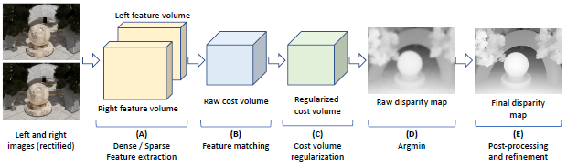

<div align="center">

# A Survey on Deep Learning Techniques for Stereo-based Depth Estimation

[Hamid Laga](https://sites.google.com/view/hamidlaga) · [Laurent Valentin Jospin](https://scholar.google.com/citations?user=qReElm8AAAAJ&hl=en) · [Farid Boussaid](https://research-repository.uwa.edu.au/en/persons/farid-boussaid) · [Mohammed Bennamoun](https://research-repository.uwa.edu.au/en/persons/mohammed-bennamoun) 

IEEE Transactions on Pattern Analysis and Machine Intelligence, 44(4), pp. 1738-1764, 2022

<p align="center">  </p>

### [Paper](https://ieeexplore.ieee.org/abstract/document/9233988) | [Supplementary Material](https://ieeexplore.ieee.org/abstract/document/9233988/media#media) | [Abstract](#abstract) | [Citation](#citation) | [Chronological Overview](#overview) | [Updates](#updates)  | [Contributors](#contributors)

</div>


## Abstract

Estimating depth from RGB images is a long-standing ill-posed problem, which has been explored for decades by the computer vision, graphics, and machine learning communities. Among the existing techniques, stereo matching remains one of the most widely used in the literature due to its strong connection to the human binocular system. Traditionally, stereo-based depth estimation has been addressed through matching hand-crafted features across multiple images. Despite the extensive amount of research, these traditional techniques still suffer in the presence of highly textured areas, large uniform regions, and occlusions. Motivated by their growing success in solving various 2D and 3D vision problems, deep learning for stereo-based depth estimation has attracted a growing interest from the community, with more than 150 papers published in this area between 2014 and 2019. This new generation of methods has demonstrated a significant leap in performance, enabling applications such as autonomous driving and augmented reality. In this paper, we provide a comprehensive survey of this new and continuously growing field of research, summarize the most commonly used pipelines, and discuss their benefits and limitations. In retrospect of what has been achieved so far, we also conjecture what the future may hold for deep learning-based stereo for depth estimation research.

This repository will be continuously maintained. Please feel free to create issues if you have any suggestions!

```
Organization of the Survey
├── Introduction
├── Scope and Taxonomy
├── Datasets
├── Depth by Stereo Matching
│   ├── Learning Feature Extraction and Matching
│   ├── Regularization and Disparity Estimation
├── End-to-end Depth from Stereo
│   ├── Feature Learning
│   ├── Cost Volume Construction
│   │   ├── 3D Cost Volumes
│   │   ├── 4D Cost Volumes
│   ├── Disparity Computation
│   ├── Variants
│   │   ├── Learning to Infer High Resolution Disparity Maps
│   │   ├── Learning for Completion and Denoising
│   │   ├── Learning for Realtime Processing
│   ├── Learning Confidence Maps
│   │   ├── Confidence From Left-Right Consistency Check
│   │   ├── Confidence From a Single Raw Disparity Map
│   │   ├── Confidence Map From Matching Densities
│   │   ├── Local versus Global Reasoning
│   │   └──  Combining Multiple Estimators
├── Learning Multiview Stereo
│   ├── Volumetric Representations
│   └── Plane-Sweep Volume Representations
├── Traininf End-to-End Stereo Methods
│   ├── Supervision Methods
│   │   ├── 3D Supervision Methods
│   │   ├── Self Supervision Methods
│   │   └── Weakly Supervision Methods
│   ├── Incorporating Additional Cues
│   │   ├── Smoothness
│   │   ├── Consistency
│   │   ├── Maximum-Depth Heuristic
│   │   └── Scale-Invariant Gradient Loss
│   ├──  Domain Adaptation and Transfer Learning
│   │   ├── Adaptation by Fine-Tuning
│   │   └── Adaptation by Data Transformation
│   └── Learning the Network Architecture
├── Discussion and Comparison
│   ├── Evaluation Protocol
│   ├── Computation Time and Memory Footprint
│   └── Reconstruction Accuracy
├── Future Research Directions
└── Conclusion
```

## Citation

If our survey helps in your research, please consider citing the following paper:

```bibtex
    @article{laga2022survey,
      title={A survey on deep learning techniques for stereo-based depth estimation},
      author={Laga, Hamid and Jospin, Laurent Valentin and Boussaid, Farid and Bennamoun, Mohammed},
      journal={IEEE Transactions on Pattern Analysis and Machine Intelligence},
      Volume = {44},
      issue  ={4},
      pages = {1738--1764},
      year={2022},
      publisher={IEEE}
    }
```


## Overview

### Chronological Overview

Coming soon ....

## Updates
We are currently collecting the papers that appeared from 2021 onwards. Stay tuned ...

## Contributors

- [Hamid Laga](https://sites.google.com/view/hamidlaga) (Murdoch University, Australia)
- [Laurent Valentin Jospin](https://scholar.google.com/citations?user=qReElm8AAAAJ&hl=en) (University of Western Australia, Australia)
- [Farid Boussaid](https://research-repository.uwa.edu.au/en/persons/farid-boussaid) (University of Western Australia, Australia)
- [Mohammed Bennamoun](https://research-repository.uwa.edu.au/en/persons/mohammed-bennamoun) (University of Western Australia, Australia)


